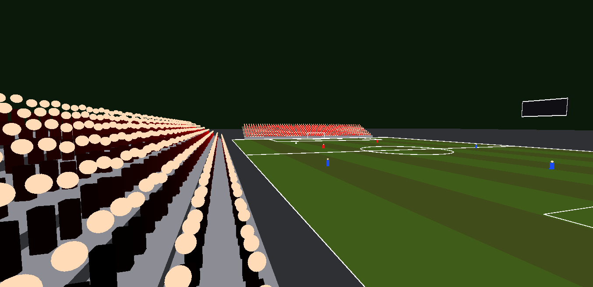
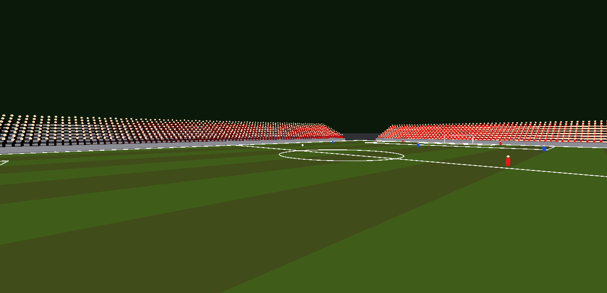
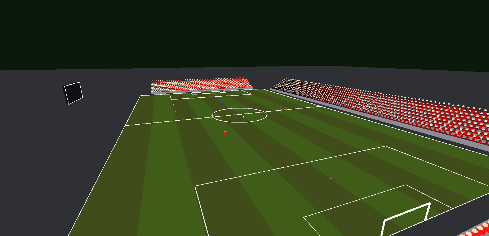
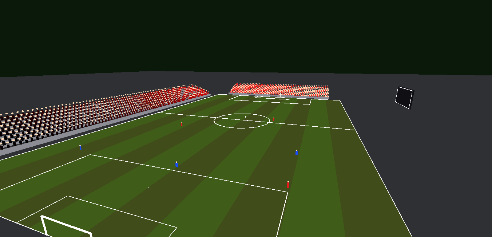

# Futebol OpenGL: Campo, bola, jogadores e placar interativo

### Instruções:

a) Desenhe um Campo de Futebol: retas/circunferências, etc;

b) Crie uma bola - a bola deverá ser movimentada usando o teclado;

c) Crie um placar - toda vez que a bola passar da linha do Gol, o placar deverá ser atualizado; e a bola deverá aparecer no meio do campo;

d) Incluir som;

e) Crie os jogadores (liberado o uso de ferramentas (Blender, etc) para este requisito;

f) Crie uma mecanica de movimentação dos jogadores atrás da bolsa (usar criatividade!);

g) Qualidade;

### Prints

