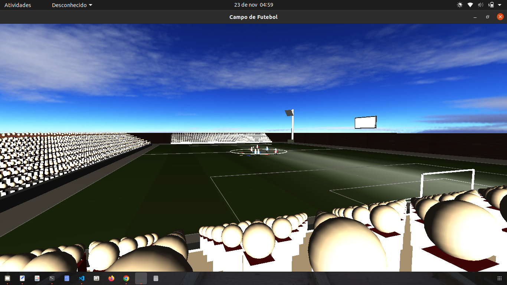
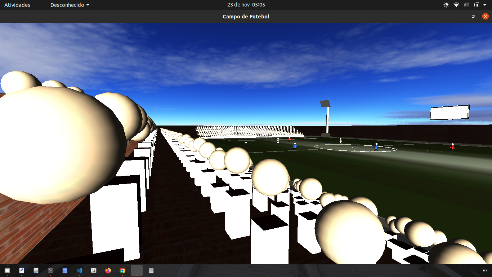
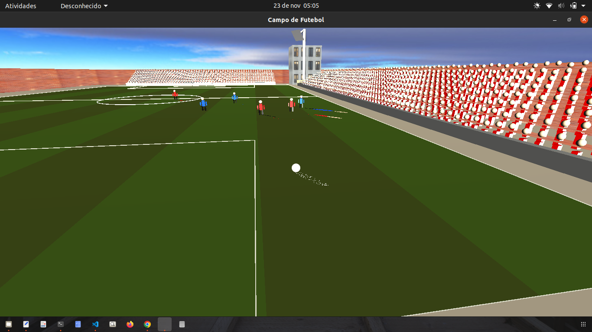
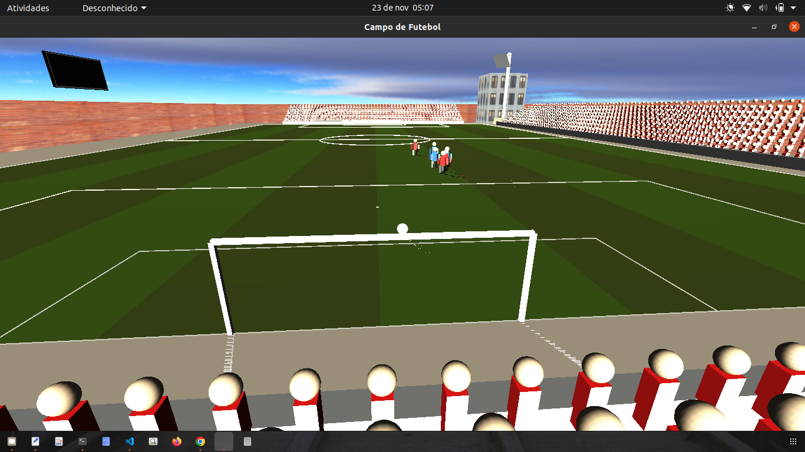

# Futebol OpenGL: Campo, bola, jogadores e placar interativo

### Instruções:

a) Desenhe um Campo de Futebol: retas/circunferências, etc;

b) Crie uma bola - a bola deverá ser movimentada usando o teclado;

c) Crie um placar - toda vez que a bola passar da linha do Gol, o placar deverá ser atualizado; e a bola deverá aparecer no meio do campo;

d) Incluir som;

e) Crie os jogadores (liberado o uso de ferramentas (Blender, etc) para este requisito;

f) Crie uma mecanica de movimentação dos jogadores atrás da bolsa (usar criatividade!);

g) Qualidade;

### Instruções 2:

a) Criar a iluminação da Modelagem, explorando diferentes Fontes de Luz, Aspectos Geométricos e Modelos de Iluminação;

b) Aplicar mapeamento de textura aos objetos;

c) Refinar a modelagem realizada;

### Prints da 1ª Fase do projeto

### Prints da 2ª Fase do projeto

